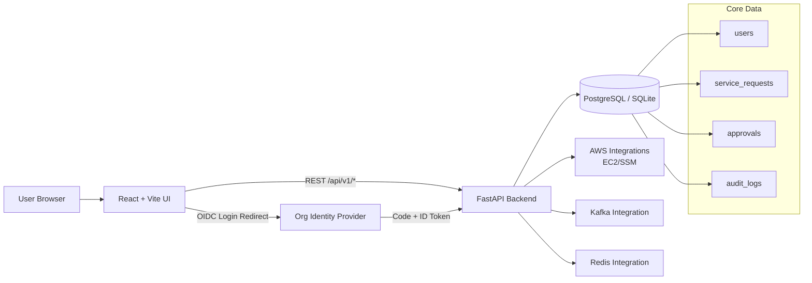
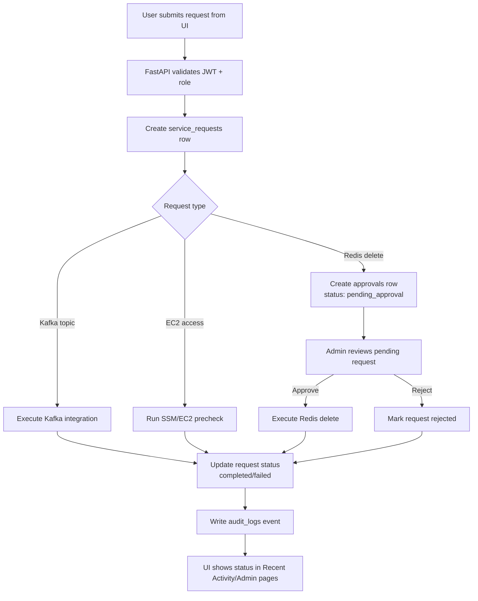

# Relay (Phase-1 IDP)

Relay is a Dev + DevOps self-service portal for common operational workflows:
- Kafka topic creation
- EC2 access request prechecks (by server IP)
- Redis key lookup and delete-request approval flow
- Admin console (overview, users, integrations, approvals, audit)
- Optional org SSO (OIDC) with domain allowlist and read-only `viewer` role

## Architecture



## Request Lifecycle



## Tech Stack

- Frontend: React + TypeScript + Vite
- Backend: FastAPI + SQLAlchemy
- Auth: JWT (local), optional OIDC SSO
- Data: PostgreSQL (recommended), SQLite (local quick-start)

## Repository Layout

- `frontend/` - React application
- `backend/` - FastAPI application
- `scripts/run-local-stack.sh` - local startup helper (API + UI)
- `docker-compose.yml` - full local stack with Postgres

## Quick Start (Local Laptop, no Docker)

### Prerequisites
- Python 3.9+
- Node 20+

### 1) Backend dependencies
```bash
cd backend
python3 -m venv ../.venv
../.venv/bin/pip install -r requirements.txt
cd ..
```

### 2) Frontend dependencies
```bash
cd frontend
npm install
cd ..
```

### 3) Run full local stack
```bash
./scripts/run-local-stack.sh
```

Open:
- UI: `http://127.0.0.1:5173`
- API docs: `http://127.0.0.1:8000/docs`

> If schema changes were added and SQLite was created earlier, reset local DB:
> `rm -f data/idp.sqlite3`

## Docker Compose (Postgres)

```bash
docker compose up --build
```

Open:
- UI: `http://localhost:8080`
- API: `http://localhost:8000/docs`

## Auth Modes

### Local username/password
Seed users on startup:
- `developer / dev123`
- `admin / admin123`

### Optional SSO (OIDC)
Set backend environment variables:
- `OIDC_ISSUER`
- `OIDC_CLIENT_ID`
- `OIDC_CLIENT_SECRET`
- `OIDC_REDIRECT_URI`
- `FRONTEND_URL`
- `ALLOWED_SSO_EMAIL_DOMAINS` (comma-separated)

SSO users are created/forced as role `viewer` (read-only).

## Main API Areas

- `GET /api/v1/catalog/kafka`
- `GET /api/v1/catalog/redis`
- `POST /api/v1/kafka/topics`
- `POST /api/v1/access/ec2`
- `GET /api/v1/redis/lookup`
- `POST /api/v1/redis/delete-requests`
- `GET /api/v1/approvals/pending`
- `POST /api/v1/approvals/{request_id}/approve`
- `POST /api/v1/approvals/{request_id}/reject`
- `GET /api/v1/admin/overview`
- `GET /api/v1/admin/users`
- `GET /api/v1/admin/integrations`
- `GET /api/v1/admin/audit/export`

## Notes for GitHub Push

If push fails:
- Use a valid remote URL format:
  - HTTPS: `https://github.com/<user>/<repo>.git`
  - SSH: `git@github.com:<user>/<repo>.git`
- `Could not resolve host` means malformed HTTPS URL.
- `Permission denied (publickey)` means SSH key auth is not configured.
